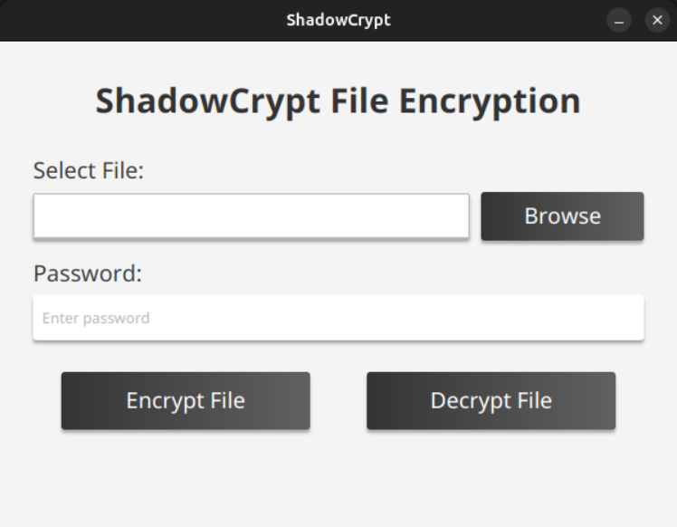
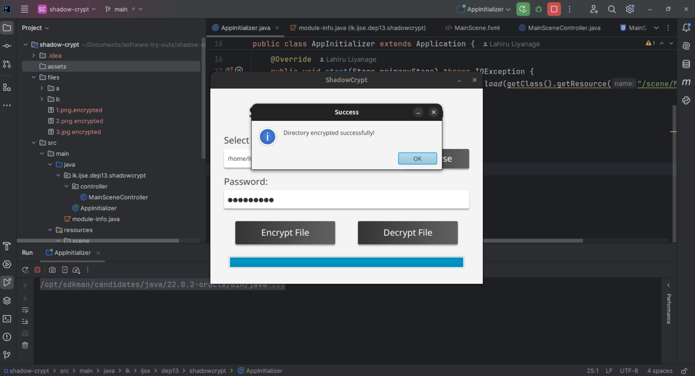
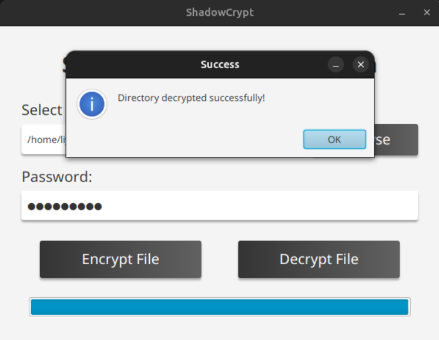
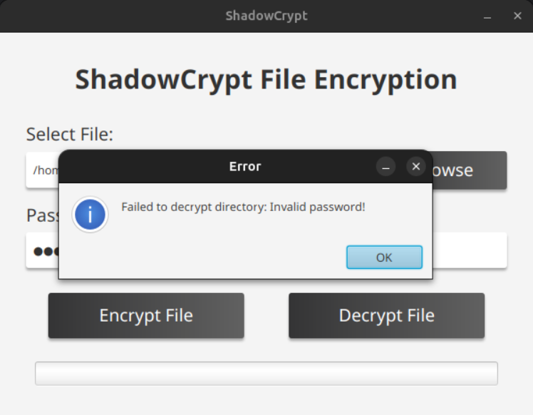

# ShadowCrypt 🛡️🔐

**Seamless File Encryption & Decryption with a User Interface**

ShadowCrypt is an automated file encryption tool that secures sensitive data by allowing users to choose folders for encryption and decryption via a graphical interface. Designed for efficiency and security, it ensures that files are encrypted with minimal user intervention while providing password-based security.

## 🚀 Features

- **User-Friendly UI** – Select folders for encryption and decryption easily.
- **Password Protection** – Secure files with a user-defined password.
- **Automated Encryption** – Encrypts files within chosen directories.
- **Seamless Decryption** – Restore encrypted files securely.
- **Efficient Performance** – Lightweight implementation with optimized processing.
- **NIO Processing** – Utilizes Java NIO for high-performance file operations.
- **Open-Source** – Modify and enhance as needed!

## 🛠️ Technologies Used

### Core Technologies
- **Java 11** – Core programming language
- **JavaFX** – GUI framework for the user interface
- **CSS** – Styling for the JavaFX components

### Key Libraries & APIs
- **Java NIO** – For efficient file operations and directory traversal
- **FileChannel** – High-performance file I/O operations
- **ByteBuffer** – Direct buffer implementation for optimized data transfer
- **Path API** – Modern file system navigation and manipulation

### Development Tools
- **Maven** – Project management and build tool
- **Scene Builder** – Visual layout tool for JavaFX
- **Git** – Version control system

## 📸 Screenshots

<table>
  <tr>
    <td></td>
    <td></td>
    <td></td>
    <td></td>
  </tr>
  <tr>
    <td align="center"><b>Main Interface</b></td>
    <td align="center"><b>Encryption Process</b></td>
    <td align="center"><b>Decryption Process</b></td>
    <td align="center"><b>Invalid Credentials</b></td>
  </tr>
</table>

## 🔧 How It Works

1. **User Selection** – Choose a folder through the graphical interface.
2. **Encryption Process** – Files are encrypted with password protection and saved securely.
3. **Decryption Process** – Users can restore files by providing the correct password.
4. **File Management** – The original files are securely deleted after encryption.

### Technical Implementation
- Uses Java NIO's `FileChannel` for efficient file operations
- Implements `ByteBuffer` for optimized data transfer
- Utilizes `Files.walkFileTree()` for recursive directory processing
- Employs atomic operations for thread-safe progress tracking
- Implements custom encryption algorithm with password verification

## 🛠️ Installation & Usage

### Prerequisites
- Java 11 or higher
- JavaFX SDK
- Maven (for building)

### Running the Application

```sh
mvn clean install
mvn javafx:run
```

### Folder Structure
```
shadow-crypt/
│── src/
│   │── main/
│   │     │── java/
│   │     └── resources/
│   └── test/
├── pom.xml
├── README.md
└── LICENCE.txt
```

## ⚠️ Disclaimer
This tool is intended for educational and personal security purposes only. Use it responsibly and do not apply it to unauthorized systems.

## 📌 Future Enhancements
- Implement **AES encryption** for stronger security
- Add **multi-threading** support for parallel processing
- Enhance **UI design** with modern JavaFX controls
- Add **file filtering** options
- Implement **compression** before encryption
- Add **backup** functionality

## 🤝 Contributing
Feel free to fork this repository and improve its capabilities. PRs are welcome!

## 📜 License
This project is licensed under the [MIT License](LICENCE.txt).

## 📩 Contact

For any questions or feedback, feel free to reach out:

- Mobile: [+94719607296](+94719607296)
- Email: [lhlahiru95@gmail.com](lhlahiru95@gmail.com)
- LinkedIn: [LahiruLiyanage](https://www.linkedin.com/in/liyanage-lahiru/)
- GitHub: [@LahiruLiyanage](https://github.com/LahiruLiyanage)

## 🔗 Stay secure with ShadowCrypt! ##

---